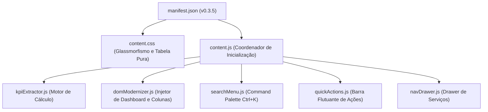

# 📋 Especificação de Negócio e Regras de Cálculo — TSE XT

**Versão da Especificação:** 1.0.0  
**Extensão:** TSE XT (Tribunal Superior Eleitoral - Extensão de Produtividade)  
**Módulo Foco:** Espelho de Ponto Mensal (`EspelhoPontoMesAction`)  
**Data:** 26/08/2026  

---

## 1. Visão Geral e Propósito

O **TSE XT** é uma extensão de navegador desenvolvida para modernizar, automatizar e fornecer clareza analítica em tempo real sobre a jornada de trabalho, saldo de horas, metas mensais e direitos remuneratórios dos servidores do Tribunal Superior Eleitoral (TSE).

A extensão opera diretamente sobre a página legada do **Meu Espaço** (`/portalservidor2/EspelhoPontoMesAction`), injetando uma camada de visualização com **Glassmorfismo Tátil**, painel de **5 KPIs uniformes** e **colunas calculadas** com estrita observância à regulamentação institucional.

---

## 2. Regras Fundamentais de Negócio

### 2.1. Desconsideração Estrita de Pecúnia no Saldo de Horas
- **Regra de Ouro:** Horas excedentes que foram autorizadas e registradas na coluna **Pecúnia** (`.h12`) são remuneradas financeiramente pelo Tribunal e **NUNCA** ingressam no saldo de horas a compensar, nem no numerador da meta ordinária do mês.
- **Fórmula de Compensação Diária ($\Delta_{\text{dia}}$):**
  $$\Delta_{\text{dia}} = \text{Horas Excedentes}_{\text{dia}} - \text{Pecúnia}_{\text{dia}}$$

### 2.2. Supressão de Banco de Horas em Regime Híbrido
- **Regra Regulamentar:** Nos meses em que o servidor possui **pelo menos 1 dia** registrado como `TRABALHO HÍBRIDO` ou `TELETRABALHO`, **não há geração nem consumo de Banco de Horas**.
- **Comportamento no Sistema:**
  - A coluna **`SALDO ACUM.`** é **automaticamente suprimida** da tabela (não é exibida no cabeçalho, nas linhas nem no rodapé).
  - O KPI de **Banco de Horas** exibe a insígnia `Regime Híbrido (Sem acúmulo de BH)`.
  - O KPI de **Saída p/ Zerar Mês** é desativado exibindo `--:--` (`Regime Híbrido`).
  - O KPI de **Meta Presencial** acompanha exclusivamente os dias com exigência presencial pactuada.

### 2.3. Carga Horária Ordinária Diária (7h vs. 8h)
- **Expediente Contínuo (Padrão):** 7 horas diárias ($420\text{ min}$).
- **Expediente com Intervalo de Almoço:** 8 horas diárias ($480\text{ min}$) quando houver **duas entradas e duas saídas** registradas no dia (`E1, S1, E2, S2`).

### 2.4. Tratamento de Fins de Semana, Feriados e Multiplicadores de Saldo
- **Dias Dispensados da Meta Ordinária:** Não são cobrados no denominador da meta mensal os dias com:
  - 🌴 Férias regulamentares
  - ✈️ Viagens a serviço / Missões
  - 🏥 Licenças de qualquer natureza (Médica, Gala, Nojo, Maternidade/Paternidade, Capacitação, Prêmio, etc.)
  - 🏛️ Feriados, Recessos Forenses e Pontos Facultativos
  - 🏠 Dias de Trabalho Híbrido / Teletrabalho
- **Multiplicadores de Horas Extras em Fins de Semana:**
  - **Sábados (+50% / fator $1.5\times$):** Horas excedentes/trabalhadas líquidas de pecúnia recebem acréscimo de 50% no cômputo do saldo ($\Delta_{\text{sáb}} = (\text{Horas Líquidas}) \times 1.5$).
  - **Domingos (Dobra / fator $2.0\times$):** Horas trabalhadas/excedentes líquidas de pecúnia são dobradas no cômputo do saldo ($\Delta_{\text{dom}} = (\text{Horas Líquidas}) \times 2.0$).
  - **Dias Úteis ($1.0\times$):** Saldo computado na proporção regular ($\Delta_{\text{útil}} = \text{Excedente} - \text{Pecúnia}$).
- **Destaque Visual:** As células com cômputo ponderado recebem badges identificadores (`+50%` e `2.0× Dobra`) com tooltips analíticos detalhando o cálculo.

### 2.5. Detecção Automática de Inconsistências de Batida (Ajuste de Ponto)
- **Regra de Detecção em Datas Passadas ($d < \text{hoje}$):**
  - **Pares Incompletos:** Registros com $E_1$ sem $S_1$, $E_2$ sem $S_2$, $E_3$ sem $S_3$ (ou saídas registradas sem entradas correspondentes).
  - **Batida Ímpar:** Contagem total de marcações no dia não divisível por 2.
  - **Ocorrência de Inconsistência:** Ocorrências textuais contendo `INCONSISTÊNCIA`, `MARCAÇÃO ÍMPAR` ou `ESQUECIMENTO`.
- **Sinalização Visual de Alerta:**
  - Linha destacada em fundo avermelhado suave (`#fef2f2`) com borda lateral esquerda em vermelho vivo (`border-left: 4px solid #ef4444`).
  - Badge de aviso `⚠️ Falta Saída 1` / `⚠️ Batida Incompleta` na célula de ocorrência com tooltip orientativo.

---

## 3. Painel de 5 KPIs Analíticos

O painel superior consolida 5 cartões métricos distribuídos horizontalmente em formato uniforme:

```
┌─────────────────┐ ┌─────────────────┐ ┌─────────────────┐ ┌─────────────────┐ ┌─────────────────┐
│ SAÍDA EXPEDIENTE│ │ BANCO DE HORAS  │ │  META DO MÊS    │ │SAÍDA P/ZERAR MÊS│ │  HORAS EXTRAS   │
│     19:39       │ │     12:15       │ │ 105:35 / 133:00 │ │     19:04       │ │ Úteis:    04:35 │
│ Faltam 03:54 hj │ │    Positivo     │ │ Faltam 27:25    │ │ Sair 00:35 cedo │ │ Fim/Fer:  03:25 │
└─────────────────┘ └─────────────────┘ └─────────────────┘ └─────────────────┘ └─────────────────┘
```

### 3.1. Card 1 — Saída Expediente (Previsão Diária)
- **Objetivo:** Calcular o horário exato em que o servidor completará a jornada de 7h (ou 8h) do dia atual.
- **Lógica:**
  - *Se entrou no 1º turno (`E1` preenchido, sem `S1`):*
    $$\text{Horário Saída} = E_1 + \text{Carga Diária (7h)}$$
  - *Se está no 2º turno (`E1, S1, E2` preenchidos, sem `S2`):*
    $$\text{Horário Saída} = E_2 + \left[\text{Carga Diária} - (S_1 - E_1)\right]$$
  - *Se já cumpriu expediente:* Exibe horário da última saída ou `Concluído`.

### 3.2. Card 2 — Banco de Horas (Saldo Homologado)
- **Objetivo:** Informar o saldo histórico homologado no banco de horas institucional.
- **Fonte de Dados:** Capturado diretamente do rodapé da página legada (*"Saldo Acumulado do Banco de Horas"*).
- **Ícone:** Guarda-sol institucional (representando descanso / folga compensatória).
- **Estados Visuais:**
  - 🟢 Verde: Saldo positivo.
  - 🔴 Vermelho: Saldo devedor.
  - 🔵 Ciano: Regime Híbrido (neutro).

### 3.3. Card 3 — Meta do Mês (Progresso Real da Jornada)
- **Objetivo:** Exibir a fração e o percentual de cumprimento da carga horária ordinária exigida no mês.
- **Denominador ($\text{Meta Total}$):**
  $$\text{Denominador} = \sum_{\text{Dias Úteis Válidos}} \text{Carga Diária (7h ou 8h)}$$
  *(Exclui fins de semana, feriados, licenças, férias, viagens e híbrido).*
- **Numerador ($\text{Horas Efetivadas}$):**
  $$\text{Numerador} = \text{Carga dos Dias Passados Cumpridos} + \text{Saldo Acumulado Atual}$$
  *(Garante que débitos sejam deduzidos e créditos líquidos de pecúnia sejam somados).*
- **Horas Restantes a Cumprir:**
  $$\text{Faltam} = \text{Carga dos Dias Restantes} - \text{Saldo Acumulado Atual}$$
- **Barra de Progresso:**
  - Gradiente Azul: Progresso normal até 100%.
  - Gradiente Verde Esmeralda: Ativado exclusivamente quando o servidor **supera 100% da meta global do mês** ($\text{Numerador} \ge \text{Denominador}$).

### 3.4. Card 4 — Saída p/ Zerar Mês (Ajuste Imediato)
- **Objetivo:** Informar a que horas o servidor pode sair **hoje** para que o saldo do mês fique exatamente zerado (`00:00`).
- **Lógica:**
  - *Se Saldo do Mês for Positivo ($+S$):*
    $$\text{Saída Zerada} = \text{Saída Normal de Hoje} - S \quad (\text{"Sair S mais cedo"})$$
  - *Se Saldo do Mês for Negativo ($-S$):*
    $$\text{Saída Zerada} = \text{Saída Normal de Hoje} + S \quad (\text{"Compensar +S hoje"})$$

### 3.5. Card 5 — Horas Extras (Detalhamento)
- **Objetivo:** Exibir separadamente o total de horas extras líquidas acumuladas:
  - **Dias Úteis / Sábados:** Soma dos excedentes líquidos de segunda a sábado.
  - **Domingos / Feriados:** Soma dos excedentes líquidos de domingos e feriados.

---

## 4. Nova Coluna Exclusiva TSE XT: `SALDO ACUM.`

### 4.1. Posicionamento na Tabela
- A coluna **`SALDO ACUM.`** é posicionada **imediatamente entre** a coluna **`PECÚNIA`** (`.h12`) e a coluna **`ADIC. NOTURNO PECÚNIA`** (`.h13`), mantendo o alinhamento estrito com as 16 colunas da tabela do espelho de ponto.

### 4.2. Algoritmo de Cálculo Linha a Linha
Para cada linha $i$ da tabela do dia $1$ até o último dia do mês:
$$\text{Saldo}_i = \text{Saldo}_{i-1} + \Delta_i$$
Onde:
- Se $i$ for **Sábado**: $\Delta_i = \left(\text{Horas Excedentes}_i - \text{Pecúnia}_i\right) \times 1.5$
- Se $i$ for **Domingo**: $\Delta_i = \left(\text{Horas Trabalhadas/Excedentes}_i - \text{Pecúnia}_i\right) \times 2.0$
- Se $i$ for **Dia Útil**: $\Delta_i = \text{Horas Excedentes}_i - \text{Pecúnia}_i$
*(Com $\text{Saldo}_0 = 0$).*

### 4.3. Semântica Visual
| Condição | Cor de Fundo | Cor do Texto | Exemplo |
| :--- | :--- | :--- | :--- |
| $\text{Saldo} > 0$ (Crédito) | `#d1fae5` (Verde suave) | `#047857` (Verde escuro) | `+00:35` |
| $\text{Saldo} < 0$ (Débito) | `#fee2e2` (Vermelho suave) | `#b91c1c` (Vermelho escuro) | `-01:22` |
| $\text{Saldo} = 0$ (Zerado) | `#f1f5f9` (Cinza claro) | `#475569` (Cinza ardósia) | `00:00` |
| Dias futuros sem registro | Transparente | `#94a3b8` | `--:--` |
| Multiplicador de Sábado | Badge Âmbar | `#b45309` | `+50%` |
| Multiplicador de Domingo | Badge Roxo | `#6d28d9` | `+100%` |
| Inconsistência / Falta Batida | `#fef2f2` (Vermelho suave) | `#991b1b` (Borda Vermelha) | `⚠️ Falta Saída 1` |

### 4.4. Linha de Totais no Rodapé
Na linha `Totais:` da tabela principal:
- Colunas 1 a 8 (`colspan="8"`): Rótulo `Totais:`
- Coluna 9: Total trabalhado bruto (ex: `135:23`)
- Coluna 10: Total de horas excedentes brutas (ex: `30:23`)
- Coluna 11: Total de pecúnia (ex: `00:00`)
- Coluna 12 (**`SALDO ACUM.`**): Saldo líquido final do mês (ex: `+00:35`)
- Colunas 13 a 16 (`colspan="4"`): Espaço de preenchimento alinhado.

---

## 5. Arquitetura de Módulos da Extensão



---

## 6. Histórico de Versões

| Versão | Data | Principais Entregas |
| :--- | :--- | :--- |
| **v0.1.0** | 20/08/2026 | Arquitetura inicial, Glassmorfismo Tátil, Paleta Azul Institucional e Command Palette. |
| **v0.2.0** | 25/08/2026 | Unificação da tabela com `display: table`, cores para Sábado/Domingo/Feriado/Hoje e ícones modernos de horas extras. |
| **v0.2.1** | 26/08/2026 | Inclusão da coluna `SALDO ACUM.`, ícone de descanso no Banco de Horas e barra de progresso da Meta. |
| **v0.2.2** | 26/08/2026 | Dedução estrita de Pecúnia (`.h12`), regra regulamentar de Regime Híbrido, distinção 7h vs 8h com almoço e filtro de licenças/afastamentos. |
| **v0.3.0** | 27/08/2026 | Multiplicadores de fins de semana (Sáb +50% / Dom Dobra 2.0x), destaque visual em badges e detector de batidas faltantes com destaque em vermelho. |
| **v0.3.1** | 28/08/2026 | Refinamento do badge de Domingo para `+100%`, ampliação da coluna `SALDO ACUM.` (88px a 102px) e centralização visual perfeita. |
| **v0.3.2** | 28/08/2026 | Alinhamento à esquerda da coluna `SALDO ACUM.` para alinhamento vertical dos números e ajuste óptico de altura dos badges. |
| **v0.3.3** | 28/08/2026 | Adição estrita de `type="button"` e `preventDefault` nos botões injetados, eliminando submissão acidental do formulário Struts. |
| **v0.3.4** | 28/08/2026 | Blindagem completa de action no formulário e normalização de URLs no menu drawer, eliminando o erro de endpoint genérico no Struts. |
| **v0.3.5** | 28/08/2026 | Delegação nativa de clique para nós do DOM original e resolução de rotas relativas Struts (prefixo `/portalservidor2/` e terminação `.action`). |
| **v0.3.6** | 28/08/2026 | Suporte ao Menu "Frequência - Alteração de ponto" (`EspelhoPontoDiaAction_consultar.action`), adequação ao Design System TSE XT, breadcrumbs contextuais, atalhos e blindagem de formulário. |
| **v0.3.7** | 28/08/2026 | Refinamentos visuais de formulário, alinhamento do label DATA: à esquerda, calendário Glassmorphic (div.calendar), realce azul institucional para Servidor/Responsável, motivo Esquecimento por padrão e moldura compacta. |
| **v0.3.8** | 28/08/2026 | Alinhamento horizontal alinhado em linha de base para rótulos (DATA:, UNIDADE:, NOME:), centralização vertical do texto "Inclusão" em tom azul escuro (#003366), harmonização do espaçamento vertical entre componentes da moldura, caixa de justificativa com 85px, contador dinâmico de 500 caracteres e remoção do espaço vazio antes dos botões. |
| **v0.3.9** | 28/08/2026 | Restauração da estrutura nativa de tabela para a div.moldura, eliminando a sobreposição de elementos na primeira linha do formulário de alteração de ponto. |
| **v0.3.10** | 28/08/2026 | Modernização completa do formulário da moldura via refatoração JS do DOM, encapsulando rótulo e campo em grupos flexíveis (.je-form-group e .je-form-row) com eliminação de tags <br>, resolvendo em definitivo qualquer sobreposição visual. |
| **v0.3.11** | 28/08/2026 | Expansão automática ao passar o mouse (:hover) nas categorias do Menu Drawer, extração abrangente de 100% dos itens de menu do portal e transição com glow azul. |
| **v0.3.12** | 28/08/2026 | Resguardo de padding lateral no campo de busca da topbar para evitar colisão do placeholder com a lupa e o badge Ctrl+K, com ocultamento inteligente do badge em resoluções menores. |
| **v0.3.13** | 28/08/2026 | Acordeão por hover com exclusão mútua: todas as categorias iniciam colapsadas e, ao mover o mouse entre elas, a nova expanda e a anterior recolhe automaticamente. |
| **v0.3.14** | 28/08/2026 | Ajustes de precisão no header (flex-shrink: 0 na marca e perfil) e resguardo estendido de 40px no input de busca para separar perfeitamente a lupa do texto. |
| **v0.3.15** | 28/08/2026 | Correção estrita do endpoint do formulário de Espelho de Ponto Mensal para EspelhoPontoMesAction_recuperar.action, eliminando o erro Struts de Action não mapeada na troca de mês/servidor. |
| **v0.3.16** | 28/08/2026 | Eliminação completa da piscada (FOUC) no carregamento de páginas com TSE XT ativo via injeção síncrona no <html> e restrição de animações de transição para o clique de alternância. |
| **v0.3.17** | 28/08/2026 | Migração para document_start no manifesto e supressão total de transições CSS de layout (largura do container, opacidade e posições) na carga e troca de servidor/mês. |
| **v0.3.18** | 28/08/2026 | Empacotamento dos componentes do topo em contêiner atômico único (#je-app-header) montado via requestAnimationFrame, eliminando saltos de layout e construções sequenciais ao consultar novos servidores. |
| **v0.3.19** | 28/08/2026 | Formulário Modal de Ajuste de Ponto Inline (`#conteudo > div:nth-child(2) > div.moldura`) na página principal `EspelhoPontoMesAction_recuperar.action` com envio AJAX e atalho no Command Palette (Ctrl+K). |


