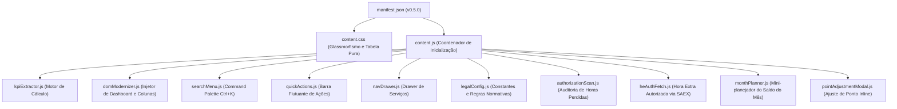

# 📋 Especificação de Negócio e Regras de Cálculo — TSE XT

**Versão da Especificação:** 1.1.0  
**Extensão:** TSE XT (Tribunal Superior Eleitoral - Extensão de Produtividade)  
**Módulo Foco:** Espelho de Ponto Mensal (`EspelhoPontoMesAction`)  
**Data:** 04/09/2026  

> A partir da v0.3.x, o detalhamento normativo (regras verificadas, roadmap de conformidade e dúvidas em aberto) passou a viver em documentos dedicados: [regras-calculo-frequencia.md](regras-calculo-frequencia.md), [roadmap-conformidade.md](roadmap-conformidade.md) e [duvidas-normativas.md](duvidas-normativas.md). Este documento mantém a visão geral do produto e das regras de negócio já implementadas.

---

## 1. Visão Geral e Propósito

O **TSE XT** é uma extensão de navegador desenvolvida para modernizar, automatizar e fornecer clareza analítica em tempo real sobre a jornada de trabalho, saldo de horas, metas mensais e direitos remuneratórios dos servidores do Tribunal Superior Eleitoral (TSE).

A extensão opera diretamente sobre a página legada do **Meu Espaço** (`/portalservidor2/EspelhoPontoMesAction`), injetando uma camada de visualização com **Glassmorfismo Tátil**, painel de **5 KPIs uniformes** e **colunas calculadas** com estrita observância à regulamentação institucional.

---

## 2. Regras Fundamentais de Negócio

### 2.1. Desconsideração Estrita de Pecúnia no Saldo de Horas
- **Regra de Ouro:** Horas excedentes que foram autorizadas e registradas na coluna **Pecúnia** (`.h12`) são remuneradas financeiramente pelo Tribunal e **NUNCA** ingressam no saldo de horas a compensar, nem no numerador da meta ordinária do mês.
- **Fórmula de Compensação Diária ($\Delta_{\text{dia}}$):**
  $$\Delta_{\text{dia}} = \text{Horas Excedentes}_{\text{dia}} - \text{Pecúnia}_{\text{dia}}$$

### 2.2. Banco de Horas em Regime Híbrido, Recesso e Mês com HE Autorizado
- **Regra Regulamentar:** Nos meses em que o servidor possui **pelo menos 1 dia** registrado como `TRABALHO HÍBRIDO` ou `TELETRABALHO`, **não há geração nem consumo de Banco de Horas** (Portaria 490/2022 art. 22/23). No **recesso** (janeiro; julho de ano não eleitoral), o acúmulo só ocorre por decisão da Diretoria-Geral (Portaria-TSE 885/2024). Num mês com **hora extra autorizada** pelo SAEX, a Portaria 380/2026 art. 13 veda a **utilização** (consumo) do banco, mas não a **aquisição** — ver detalhamento dos três estados e o que ainda falta implementar em [roadmap-conformidade.md R3](roadmap-conformidade.md#r3--🔴-três-estados-de-banco-de-horas).
- **Comportamento no Sistema:**
  - Em regime híbrido, a coluna **`SALDO ACUM.`** é **automaticamente suprimida** da tabela (não é exibida no cabeçalho, nas linhas nem no rodapé).
  - O KPI **Banco de Horas** exibe o saldo homologado + o que o mês tende a **adicionar** (horas homologáveis) ou **consumir**, com insígnia por regime: `Sem acúmulo` (híbrido), `Consumo vedado` (HE autorizado, art. 13) ou `Acúmulo só por decisão da DG` (recesso).
  - O KPI **Saída p/ Zerar Mês** (hoje fundido em "Saída de Hoje") é desativado quando o consumo do banco está vedado no mês.
  - O KPI **Meta do Mês** acompanha exclusivamente a jornada ordinária dos dias com exigência presencial pactuada.

### 2.3. Carga Horária Ordinária Diária (7h / 8h / 5h no recesso)
- **Turno Único (Padrão):** 7 horas diárias ($420\text{ min}$) — 1 entrada e 1 saída, sem intervalo.
- **Com Intervalo de Almoço:** 8 horas diárias ($480\text{ min}$) — o gatilho é a **2ª entrada** registrada no dia (`E2`), não mais a exigência das 4 batidas completas.
- **Recesso (janeiro; julho de ano não eleitoral):** jornada reduzida a **5 horas** para quem cumpre turno único (Portaria-TSE 885/2024 e sucessoras anuais; Res.-TSE 461/2023 para julho); dias com intervalo de almoço seguem 8h.
- **Fonte única:** `legalConfig.dailyTargetMinutes({ e2, e3, year, month })`, usada pelo cálculo de saldo, pelos KPIs e pela Auditoria de Horas Perdidas — ver [roadmap-conformidade.md R4](roadmap-conformidade.md#r4--🟡-jornada-alvo-diária-7h--8h--5h-no-recesso).

### 2.4. Tratamento de Fins de Semana, Feriados e Multiplicadores de Saldo
- **Dias Dispensados da Meta Ordinária:** Não são cobrados no denominador da meta mensal os dias com:
  - 🌴 Férias regulamentares
  - ✈️ Viagens a serviço / Missões
  - 🏥 Licenças de qualquer natureza (Médica, Gala, Nojo, Maternidade/Paternidade, Capacitação, Prêmio, etc.)
  - 🏛️ Feriados, Recessos Forenses e Pontos Facultativos
  - 🏠 Dias de Trabalho Híbrido / Teletrabalho
- **Multiplicadores de Horas Extras em Fins de Semana:**
  - **Sábados (+50% / fator $1.5\times$):** Horas excedentes/trabalhadas líquidas de pecúnia recebem acréscimo de 50% no cômputo do saldo ($\Delta_{\text{sáb}} = (\text{Horas Líquidas}) \times 1.5$).
  - **Domingos (Dobra / fator $2.0\times$):** Horas trabalhadas/excedentes líquidas de pecúnia são dobradas no cômputo do saldo ($\Delta_{\text{dom}} = (\text{Horas Líquidas}) \times 2.0$).
  - **Dias Úteis ($1.0\times$):** Saldo computado na proporção regular ($\Delta_{\text{útil}} = \text{Excedente} - \text{Pecúnia}$).
- **Destaque Visual:** As células com cômputo ponderado recebem badges identificadores (`+50%` e `2.0× Dobra`) com tooltips analíticos detalhando o cálculo.

### 2.5. Detecção Automática de Inconsistências de Batida (Ajuste de Ponto)
- **Regra de Detecção em Datas Passadas ($d < \text{hoje}$):**
  - **Pares Incompletos:** Registros com $E_1$ sem $S_1$, $E_2$ sem $S_2$, $E_3$ sem $S_3$ (ou saídas registradas sem entradas correspondentes).
  - **Batida Ímpar:** Contagem total de marcações no dia não divisível por 2.
  - **Ocorrência de Inconsistência:** Ocorrências textuais contendo `INCONSISTÊNCIA`, `MARCAÇÃO ÍMPAR` ou `ESQUECIMENTO`.
- **Sinalização Visual de Alerta:**
  - Linha destacada em fundo avermelhado suave (`#fef2f2`) com borda lateral esquerda em vermelho vivo (`border-left: 4px solid #ef4444`).
  - Badge de aviso `⚠️ Falta Saída 1` / `⚠️ Batida Incompleta` na célula de ocorrência com tooltip orientativo.

---

## 3. Painel de 5 KPIs Analíticos

**Reorganizado na v0.5.x** (fases F1–F6 — ver [proposta-kpis-planejamento.md](proposta-kpis-planejamento.md)) para responder três perguntas de planejamento: quanto devo/sou credor no mês, quanto vai entrar/sair do banco, e quanto de hora extra está autorizado/feito/aberto. O painel superior consolida 5 cartões métricos distribuídos horizontalmente:

```
┌────────────────┐┌────────────────┐┌────────────────┐┌────────────────┐┌────────────────┐
│ SAÍDA DE HOJE  ││ SALDO DO MÊS   ││ BANCO DE HORAS ││ HORA EXTRA      ││ META DO MÊS    │
│    19:24       ││    −02:45      ││    12:15       ││  (PECÚNIA)      ││ 88:20 / 133:00 │
│ Jornada: 7h    ││ devedor        ││ +05:50 homolog.││ Sem/Sáb (+50%) ││ ▓▓▓▓▓▓░░ 66%   │
│ Zerar mês:     ││ ▓▓▓▓▓▓░░ 66%   ││ → banco        ││ feito 12:15    ││ Faltam 44:40   │
│ compensar+2h45 ││ 6 dias úteis   ││ (saldo hoje ok)││ Dom/Fer (+100%)││ em 6 dias      │
│ hoje           ││ restantes      ││                ││ feito 06:00    ││ jornada ordin. │
└────────────────┘└────────────────┘└────────────────┘└────────────────┘└────────────────┘
```

### 3.1. Card 1 — Saída de Hoje (Previsão Diária + Zerar o Mês)
- **Objetivo:** Calcular o horário exato em que o servidor completa a jornada do dia (7h turno único / 8h com intervalo / 5h no recesso — [§2.3](#23-carga-horária-ordinária-diária-7h--8h--5h-no-recesso)), e a que horas sair hoje para zerar o saldo do mês.
- **Lógica da previsão diária:**
  - *Se entrou no 1º turno (`E1` preenchido, sem `S1`):*
    $$\text{Horário Saída} = E_1 + \text{Carga Diária}$$
  - *Se está no 2º turno (`E1, S1, E2` preenchidos, sem `S2`):*
    $$\text{Horário Saída} = E_2 + \left[\text{Carga Diária} - (S_1 - E_1)\right]$$
  - *Se já cumpriu expediente:* Exibe horário da última saída ou `Concluído`.
- **Lógica de zerar o mês** (2ª linha; oculta quando o consumo do banco está vedado — [§2.2](#22-banco-de-horas-em-regime-híbrido-recesso-e-mês-com-he-autorizado)):
  - *Saldo do Mês Positivo ($+S$):* $\text{Saída Zerada} = \text{Saída Normal de Hoje} - S$ (`"Sair S mais cedo"`).
  - *Saldo do Mês Negativo ($-S$):* $\text{Saída Zerada} = \text{Saída Normal de Hoje} + S$ (`"Compensar +S hoje"`).

### 3.2. Card 2 — Saldo do Mês (Devedor / Credor)
- **Objetivo:** Número único, líquido de pecúnia, com a projeção de hoje já somada.
- **Estados Visuais:** 🟢 credor · 🟡 devedor · ⚪ zero.
- **Mini-planejador ("planejar ›"):** simulação de quanto fazer por dia útil restante para zerar o mês, ou o fechamento projetado para um esforço diário informado (aceita valor negativo). Oculto em mês já encerrado/homologado.

### 3.3. Card 3 — Banco de Horas (Saldo Homologado + Tendência do Mês)
- **Objetivo:** Informar o saldo histórico homologado no banco de horas institucional e o que o mês corrente tende a adicionar (horas homologáveis) ou consumir dele.
- **Fonte de Dados:** Saldo capturado do rodapé da página legada (*"Saldo Acumulado do Banco de Horas"*); tendência calculada a partir do saldo do mês e da parcela `Horas Excedentes Homologadas`.
- **Ícone:** Guarda-sol institucional (representando descanso / folga compensatória).
- **Estados por Regime:** Normal · Híbrido (`Sem acúmulo`) · HE autorizado (`Consumo vedado` + prévia homologável) · Recesso (`Acúmulo só por decisão da DG`) — ver [§2.2](#22-banco-de-horas-em-regime-híbrido-recesso-e-mês-com-he-autorizado).

### 3.4. Card 4 — Hora Extra em Pecúnia (Executado × Autorizado via SAEX)
- **Objetivo:** Mostrar quanto de hora extra remunerada (pecúnia) já foi feito frente ao autorizado, separado por tipo de dia.
- **Blocos:** Semana/Sábado (+50%) e Domingo/Feriado (+100%), cada um como fração `feito/autorizado` com barra de progresso proporcional.
- **Fonte do autorizado:** lida diretamente do SAEX — endpoint por trás do ícone de relógio de cada dia (`AutorizacaoHoraExcedenteAction_execute`), deduplicado por número de autorização e classificado por bloco. Sem autorização vinculada, o bloco mostra só o "feito"; sem nenhuma autorização no mês, o rodapé cai para o teto legal de 60h/mês.

### 3.5. Card 5 — Meta do Mês (Jornada Ordinária)
- **Objetivo:** Exibir a fração e o percentual de cumprimento da carga horária ordinária exigida no mês (sem hora extra).
- **Denominador ($\text{Meta Total}$):**
  $$\text{Denominador} = \sum_{\text{Dias Úteis Válidos}} \text{Carga Diária (7h/8h/5h)}$$
  *(Exclui fins de semana, feriados, licenças, férias, viagens e híbrido).*
- **Numerador ($\text{Horas Efetivadas}$):**
  $$\text{Numerador} = \text{Carga dos Dias Passados Cumpridos} + \text{Saldo Acumulado Atual}$$
- **Horas Restantes a Cumprir:**
  $$\text{Faltam} = \text{Carga dos Dias Restantes} - \text{Saldo Acumulado Atual}$$
- **Barra de Progresso:** Gradiente Azul até 100%; Gradiente Verde Esmeralda ao superar 100% da meta global do mês.

---

## 4. Nova Coluna Exclusiva TSE XT: `SALDO ACUM.`

### 4.1. Posicionamento na Tabela
- A coluna **`SALDO ACUM.`** é posicionada **imediatamente entre** a coluna **`PECÚNIA`** (`.h12`) e a coluna **`ADIC. NOTURNO PECÚNIA`** (`.h13`), mantendo o alinhamento estrito com as 16 colunas da tabela do espelho de ponto.

### 4.2. Algoritmo de Cálculo Linha a Linha
Para cada linha $i$ da tabela do dia $1$ até o último dia do mês:
$$\text{Saldo}_i = \text{Saldo}_{i-1} + \Delta_i$$
Onde:
- Se $i$ for **Sábado**: $\Delta_i = \left(\text{Horas Excedentes}_i - \text{Pecúnia}_i\right) \times 1.5$
- Se $i$ for **Domingo**: $\Delta_i = \left(\text{Horas Trabalhadas/Excedentes}_i - \text{Pecúnia}_i\right) \times 2.0$
- Se $i$ for **Dia Útil**: $\Delta_i = \text{Horas Excedentes}_i - \text{Pecúnia}_i$
*(Com $\text{Saldo}_0 = 0$).*

### 4.3. Semântica Visual
| Condição | Cor de Fundo | Cor do Texto | Exemplo |
| :--- | :--- | :--- | :--- |
| $\text{Saldo} > 0$ (Crédito) | `#d1fae5` (Verde suave) | `#047857` (Verde escuro) | `+00:35` |
| $\text{Saldo} < 0$ (Débito) | `#fee2e2` (Vermelho suave) | `#b91c1c` (Vermelho escuro) | `-01:22` |
| $\text{Saldo} = 0$ (Zerado) | `#f1f5f9` (Cinza claro) | `#475569` (Cinza ardósia) | `00:00` |
| Dias futuros sem registro | Transparente | `#94a3b8` | `--:--` |
| Multiplicador de Sábado | Badge Âmbar | `#b45309` | `+50%` |
| Multiplicador de Domingo | Badge Roxo | `#6d28d9` | `+100%` |
| Inconsistência / Falta Batida | `#fef2f2` (Vermelho suave) | `#991b1b` (Borda Vermelha) | `⚠️ Falta Saída 1` |

### 4.4. Linha de Totais no Rodapé
Na linha `Totais:` da tabela principal:
- Colunas 1 a 8 (`colspan="8"`): Rótulo `Totais:`
- Coluna 9: Total trabalhado bruto (ex: `135:23`)
- Coluna 10: Total de horas excedentes brutas (ex: `30:23`)
- Coluna 11: Total de pecúnia (ex: `00:00`)
- Coluna 12 (**`SALDO ACUM.`**): Saldo líquido final do mês (ex: `+00:35`)
- Colunas 13 a 16 (`colspan="4"`): Espaço de preenchimento alinhado.

---

## 5. Auditoria de Horas Perdidas

**Introduzida na v0.4.x.** Modal que varre o Espelho de Ponto do servidor desde 2009 e quantifica as horas trabalhadas que nunca viraram pecúnia nem banco de horas.

### 5.1. Categorias (P1–P4)
| Categoria | Origem |
| :--- | :--- |
| **P1 — Não Homologadas** | Excedente que a chefia não homologou (`Horas Excedentes Não Homologadas` do Extrato) — perda confirmada, valor exato. |
| **P2 — Excedente de dia útil absorvido** | Excedente do dia útil travado no teto da jornada ordinária / `Compl. Jorn. Mínima`, sem virar pecúnia nem banco — estimativa. |
| **P3 — Descarte de fim de semana/feriado** | Trabalho de sábado/domingo/feriado em mês de regime híbrido, onde o serviço extraordinário é integralmente suprimido (Portarias 490/2022 e 380/2026) — não entra como perda (é estrutural do regime), mas fica somado à parte no tooltip e no CSV. |
| **P4 — Crédito aquém da fórmula** | Diferença entre o crédito teórico (`Úteis×1 + Sáb×1,5 + DomFer×2`) e o que o Extrato efetivamente registrou como `Horas Adquiridas` — estimativa ([duvidas-normativas.md D4](duvidas-normativas.md)). |

### 5.2. Comportamento
- Cada categoria é explicada em linguagem clara na própria tela, com a origem do número e link para a norma que a fundamenta; marca **"valor exato"** (P1) vs. **"estimativa"** (P2–P4).
- Gráfico de barras cronológico das perdas por ano (cores institucionais do TSE XT: `primary-dark → primary → primary-light → accent-cyan`, do mais severo ao mais brando).
- Tabela ordenável por qualquer coluna (mês, regime, pecúnia, homologadas, P1–P4, perdido); clicar numa linha abre o Espelho de Ponto do mês correspondente (com confirmação).
- Resultado persistido por matrícula em `chrome.storage.local`: a tela sempre reabre com a última varredura e, por padrão, atualiza só o delta (meses ainda não varridos); **Full Update** refaz a varredura completa.

---

## 6. Arquitetura de Módulos da Extensão



---

## 7. Histórico de Versões

| Versão | Data | Principais Entregas |
| :--- | :--- | :--- |
| **v0.1.0** | 20/08/2026 | Arquitetura inicial, Glassmorfismo Tátil, Paleta Azul Institucional e Command Palette. |
| **v0.2.0** | 25/08/2026 | Unificação da tabela com `display: table`, cores para Sábado/Domingo/Feriado/Hoje e ícones modernos de horas extras. |
| **v0.2.1** | 26/08/2026 | Inclusão da coluna `SALDO ACUM.`, ícone de descanso no Banco de Horas e barra de progresso da Meta. |
| **v0.2.2** | 26/08/2026 | Dedução estrita de Pecúnia (`.h12`), regra regulamentar de Regime Híbrido, distinção 7h vs 8h com almoço e filtro de licenças/afastamentos. |
| **v0.3.0** | 27/08/2026 | Multiplicadores de fins de semana (Sáb +50% / Dom Dobra 2.0x), destaque visual em badges e detector de batidas faltantes com destaque em vermelho. |
| **v0.3.1** | 28/08/2026 | Refinamento do badge de Domingo para `+100%`, ampliação da coluna `SALDO ACUM.` (88px a 102px) e centralização visual perfeita. |
| **v0.3.2** | 28/08/2026 | Alinhamento à esquerda da coluna `SALDO ACUM.` para alinhamento vertical dos números e ajuste óptico de altura dos badges. |
| **v0.3.3** | 28/08/2026 | Adição estrita de `type="button"` e `preventDefault` nos botões injetados, eliminando submissão acidental do formulário Struts. |
| **v0.3.4** | 28/08/2026 | Blindagem completa de action no formulário e normalização de URLs no menu drawer, eliminando o erro de endpoint genérico no Struts. |
| **v0.3.5** | 28/08/2026 | Delegação nativa de clique para nós do DOM original e resolução de rotas relativas Struts (prefixo `/portalservidor2/` e terminação `.action`). |
| **v0.3.6** | 28/08/2026 | Suporte ao Menu "Frequência - Alteração de ponto" (`EspelhoPontoDiaAction_consultar.action`), adequação ao Design System TSE XT, breadcrumbs contextuais, atalhos e blindagem de formulário. |
| **v0.3.7** | 28/08/2026 | Refinamentos visuais de formulário, alinhamento do label DATA: à esquerda, calendário Glassmorphic (div.calendar), realce azul institucional para Servidor/Responsável, motivo Esquecimento por padrão e moldura compacta. |
| **v0.3.8** | 28/08/2026 | Alinhamento horizontal alinhado em linha de base para rótulos (DATA:, UNIDADE:, NOME:), centralização vertical do texto "Inclusão" em tom azul escuro (#003366), harmonização do espaçamento vertical entre componentes da moldura, caixa de justificativa com 85px, contador dinâmico de 500 caracteres e remoção do espaço vazio antes dos botões. |
| **v0.3.9** | 28/08/2026 | Restauração da estrutura nativa de tabela para a div.moldura, eliminando a sobreposição de elementos na primeira linha do formulário de alteração de ponto. |
| **v0.3.10** | 28/08/2026 | Modernização completa do formulário da moldura via refatoração JS do DOM, encapsulando rótulo e campo em grupos flexíveis (.je-form-group e .je-form-row) com eliminação de tags <br>, resolvendo em definitivo qualquer sobreposição visual. |
| **v0.3.11** | 28/08/2026 | Expansão automática ao passar o mouse (:hover) nas categorias do Menu Drawer, extração abrangente de 100% dos itens de menu do portal e transição com glow azul. |
| **v0.3.12** | 28/08/2026 | Resguardo de padding lateral no campo de busca da topbar para evitar colisão do placeholder com a lupa e o badge Ctrl+K, com ocultamento inteligente do badge em resoluções menores. |
| **v0.3.13** | 28/08/2026 | Acordeão por hover com exclusão mútua: todas as categorias iniciam colapsadas e, ao mover o mouse entre elas, a nova expanda e a anterior recolhe automaticamente. |
| **v0.3.14** | 28/08/2026 | Ajustes de precisão no header (flex-shrink: 0 na marca e perfil) e resguardo estendido de 40px no input de busca para separar perfeitamente a lupa do texto. |
| **v0.3.15** | 28/08/2026 | Correção estrita do endpoint do formulário de Espelho de Ponto Mensal para EspelhoPontoMesAction_recuperar.action, eliminando o erro Struts de Action não mapeada na troca de mês/servidor. |
| **v0.3.16** | 28/08/2026 | Eliminação completa da piscada (FOUC) no carregamento de páginas com TSE XT ativo via injeção síncrona no <html> e restrição de animações de transição para o clique de alternância. |
| **v0.3.17** | 28/08/2026 | Migração para document_start no manifesto e supressão total de transições CSS de layout (largura do container, opacidade e posições) na carga e troca de servidor/mês. |
| **v0.3.18** | 28/08/2026 | Empacotamento dos componentes do topo em contêiner atômico único (#je-app-header) montado via requestAnimationFrame, eliminando saltos de layout e construções sequenciais ao consultar novos servidores. |
| **v0.3.19** | 28/08/2026 | Formulário Modal de Ajuste de Ponto Inline (`#conteudo > div:nth-child(2) > div.moldura`) na página principal `EspelhoPontoMesAction_recuperar.action` com envio AJAX e atalho no Command Palette (Ctrl+K). |
| **v0.3.20 – v0.3.63** | 28/08–01/09/2026 | Suporte à visão de terceiros no ajuste de ponto, robustez de Action/rotas Struts, refinamentos de formulário e drawer, aviso de aplicação experimental no 1º uso, ajustes cosméticos e correções de saldo/pecúnia por tipo de dia (ver `backup/pre-squash-0.3.x`). |
| **v0.3.0 (release)** | 01/09/2026 | Série 0.3.x consolidada num único commit e tag — cálculo de saldo unificado (`balanceCalc.js`), suporte a meses fechados/homologados (`HORAS AJUST.`), ajuste de ponto inline, tela Alteração de Ponto, robustez de carregamento (`document_start`, anti-FOUC). |
| **v0.4.0 – v0.4.9** | 01–03/09/2026 | Conformidade normativa (R3–R6): três estados de banco de horas, jornada diária automática 7h/8h/5h no recesso, tetos legais de HE, mês com HE autorizado; projeção do saldo do dia corrente antes do fechamento noturno da coluna oficial; **Auditoria de Horas Perdidas** ([§5](#5-auditoria-de-horas-perdidas)). |
| **v0.5.0 (release)** | 04/09/2026 | Séries 0.4.x e 0.5.x consolidadas num único commit e tag — painel de KPIs reorganizado para planejamento ([§3](#3-painel-de-5-kpis-analíticos)), hora extra autorizada lida direto do SAEX, mini-planejador do saldo do mês, identidade visual (alerta amarelo/erro rosa), glow animado, preferências de aparência e correções de robustez de carregamento em aba de segundo plano. |

> A partir daqui, o detalhamento entrega-a-entrega de cada versão de patch (`0.5.x`, `0.6.x`, ...) é mantido no changelog embutido da extensão — `content/modules/version.js` (acessível pelo ícone ⓘ no popup) — e não é replicado nesta tabela. Este documento registra apenas os marcos de série/release.


